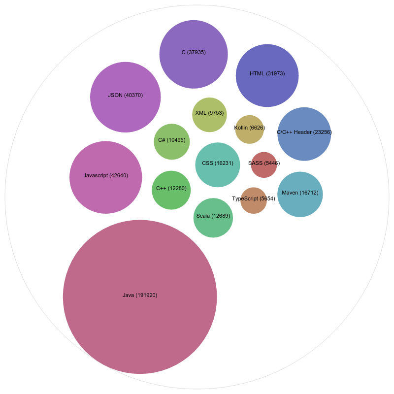
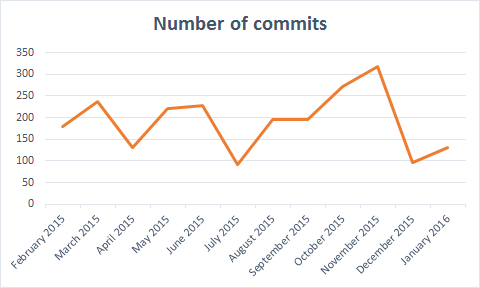

# HEADS Cloc
## Tools
### get_projects
Located in *./get_projects*

Simple tool used to list the repositories located in a github group.

For example :
```bash
$ node get_projects/index.js kevoree
kevoree/boot2kevoree
kevoree/boot2kevoree-cli
kevoree/CloudMOOBenchmark
kevoree/comparch2014
kevoree/docker-image-java
kevoree/docker-image-javase_compact2
kevoree/docker-image-js
kevoree/docker-image-kevoree-browser-runtime
kevoree/docker-image-registry-replica
# [..]
```

**WARNING ** : This tool currently return only the first 300 projects of a group only.

## Filling the database
**count.sh** does the following operations :
 * starting a mysql container
 * reset the content of the container
 * install [cloc](http://cloc.sourceforge.net/)
 * starts cloc in every projects added as subprojects on *./projects/\_groupname\_/\_projects\_name_*

## How to add a projects
Just add a subproject in the *./projects* directory, accordingly to the norm *./projects/\_groupname\_/\_projects\_name_*

# Analysis
With [Raw](http://raw.densitydesign.org/) we can quickly generate nice dataviz :
## Number of lines of code by languages


# Global GitHub activity by months


```sql
# count the number of loc by language, no data cleanup
SELECT sum(x.nCode) as cptr, x.Language FROM t as x GROUP BY x.Language ORDER BY cptr DESC;

# select every relevant datas
SELECT *
FROM t
WHERE t.File NOT LIKE "%.min.js"
AND t.File_basename <> 'nodes.d.ts'
AND t.File_basename <> 'font-awesome.css'
AND t.File_basename NOT LIKE 'jquery%.js'
AND  t.File_basename <> 'bootstrap.css'
AND nCode < 10000
ORDER BY t.nCode DESC;

# count the number of files in the db
SELECT count(*)
FROM t
WHERE t.File NOT LIKE "%.min.js"
AND t.File_basename <> 'nodes.d.ts'
AND t.File_basename <> 'font-awesome.css'
AND t.File_basename NOT LIKE 'jquery%.js'
AND  t.File_basename <> 'bootstrap.css'
AND nCode < 10000
ORDER BY t.nCode DESC;

# Prettify the selection, cleanup + nice text and limit to the top 15
SELECT sum(t.nCode) as ttCode, CONCAT(t.Language, ' (', sum(t.nCode), ')') as Libelle
FROM t
WHERE t.File NOT LIKE "%.min.js"
AND t.File_basename <> 'nodes.d.ts'
AND t.File_basename <> 'font-awesome.css'
AND t.File_basename NOT LIKE 'jquery%.js'
AND  t.File_basename <> 'bootstrap.css'
AND nCode < 10000
GROUP BY t.Language
ORDER BY ttCode DESC
LIMIT 15;


# activity by week
SELECT subq.str_week as str_week, subq.nb_commit as nb_commit from (
SELECT sum(a.activity) as nb_commit, min(a.week) as timestamp_week, DATE_FORMAT(FROM_UNIXTIME(a.week), "%d/%m/%Y") as str_week
FROM activity as a
GROUP BY DATE_FORMAT(FROM_UNIXTIME(a.week), "%d/%m/%Y")
ORDER BY 2) subq
WHERE subq.nb_commit > 0;

#activity by month
SELECT subq.str_month as str_month, subq.nb_commit as nb_commit from (
SELECT sum(a.activity) as nb_commit, min(a.week) as timestamp_week, DATE_FORMAT(FROM_UNIXTIME(a.week), "%M %Y") as str_month
FROM activity as a
GROUP BY DATE_FORMAT(FROM_UNIXTIME(a.week), "%M %Y")
ORDER BY 2) subq
WHERE subq.nb_commit > 0;
```
